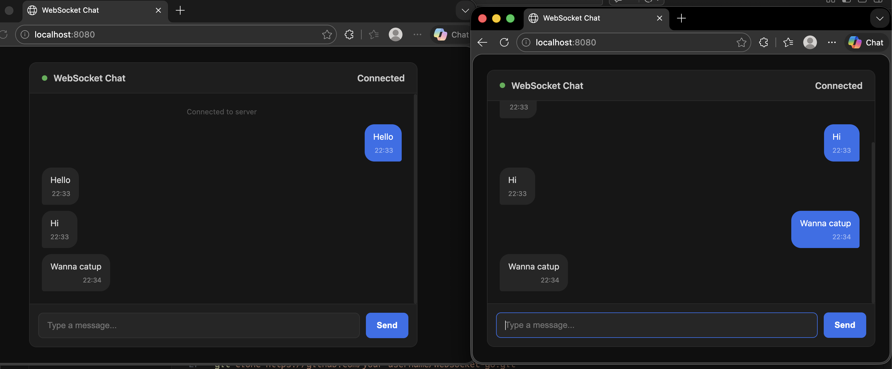

# websocket-go

A minimal real-time chat server written in Go using WebSockets, with a built-in browser UI.



## Features

- Real-time messaging between multiple clients via WebSockets
- Broadcast hub — every connected client receives all messages
- Built-in dark-themed chat UI served at `/`
- Ping/pong keepalive with write deadlines for reliable connection handling
- Auto-reconnect on the frontend if the server drops

## Stack

- **Backend** — Go + [gorilla/websocket](https://github.com/gorilla/websocket)
- **Frontend** — Vanilla HTML/CSS/JS (no dependencies)

## Getting Started

### Prerequisites

- Go 1.21+

### Install & Run

```bash
git clone https://github.com/your-username/websocket-go.git
cd websocket-go
go mod tidy
go run app.go
```

Server starts on `http://localhost:8080`.

### Usage

Open `http://localhost:8080` in **two or more browser tabs** — messages typed in one tab appear in all others instantly.

**Chat via terminal:**
```bash
wscat -c ws://localhost:8080/ws
```

**Chat on your local network:**
```bash
# Find your local IP
ipconfig getifaddr en0
# Share http://<your-ip>:8080 with anyone on the same network
```

**Expose publicly with ngrok:**
```bash
ngrok http 8080
# Share the generated https URL
```

## Project Structure

```
.
├── app.go       # WebSocket server, hub, and HTTP handler
├── index.html   # Browser chat UI
├── go.mod
└── go.sum
```

## How It Works

```
Browser/wscat
     │
     │  WebSocket (/ws)
     ▼
 serveWs() ──► Hub.run()
     │              │
  readPump    broadcast chan
  writePump   register chan
              unregister chan
```

- Each client gets a `readPump` goroutine (reads incoming messages → broadcasts) and a `writePump` goroutine (writes outgoing messages + sends pings).
- The `Hub` is the single source of truth for connected clients — all channel operations are handled in one goroutine to avoid map race conditions.

## License

MIT
